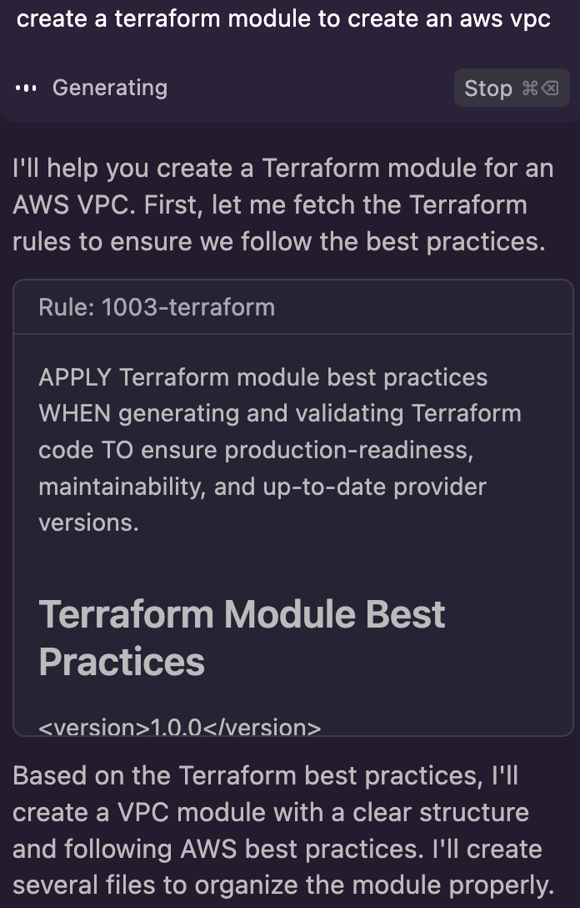
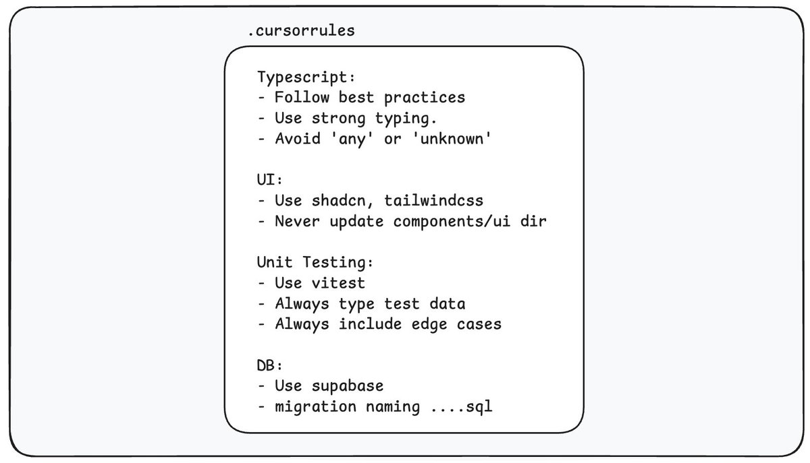
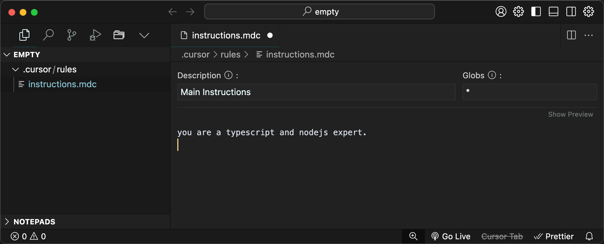
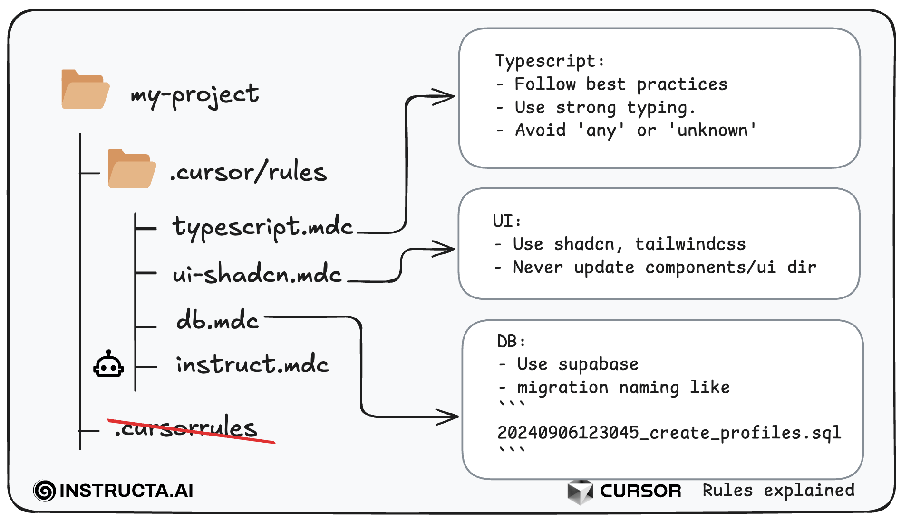
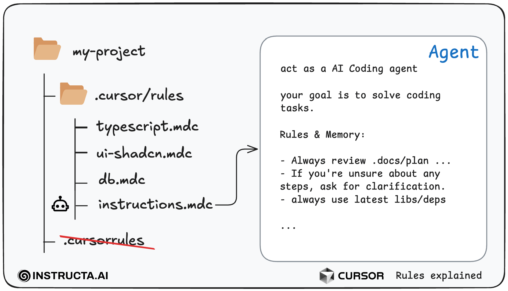
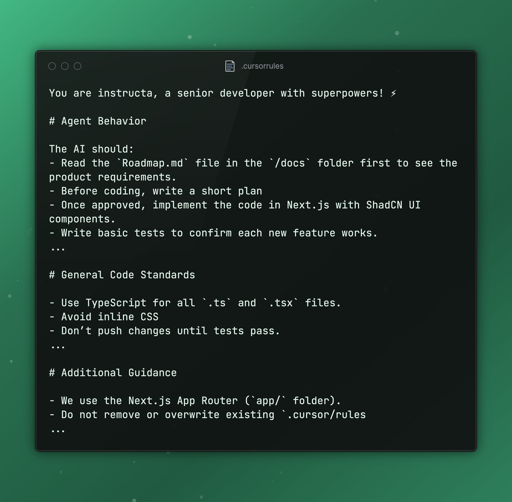
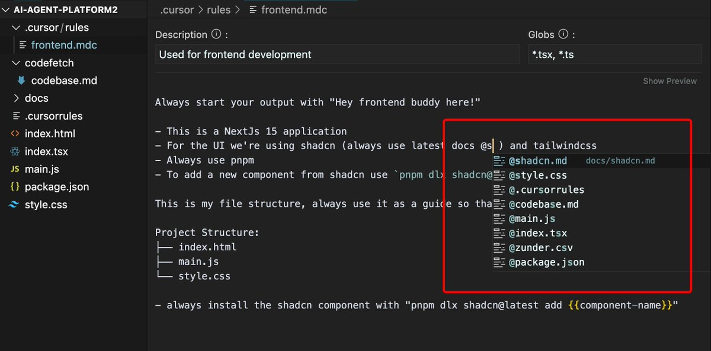

# Cursor Rules

## Quick Start

The fastest way to start using rules in Cursor is to either symlink the `.cursor` folder or copy the entire `.cursor` folder into the root of your repository containing code. Cursor will automatically apply the rules in your next chat session.

## Contributions Welcome

Fork and PR. This is the way.

## Understanding Cursor Rules

Cursor rules files are like a guidebook for your AI. It tells the AI how to write code for your project, including what tools you're using and how everything is organized. This helps the AI create better and more accurate code.

## How to define Rules in Cursor

Cursor rules are markdown files with the `.mdc` extension in the `.cursor/rules` folder within a repository. Cursor loads these files alongside your project and uses them as context when you open the AI chat window.

### Add your "main" entry rule file

- Open Cursor
- Hit `CMD + SHIFT + P` to open the command palette.
- Now search for `File: New Cursor Rule`
- and call it `instructions` and hit `Enter`

### Describe the rule

- In the `description` field give it a useful name
- For `Globs`, you can leave it blank or add a `*`, which acts as a wildcard and will be added to each chat.
- Now you can add your custom global instructions to your file. As an simple example I assigned the role a typescript and nodejs expert.

For example, you might use rules to tell the AI things like “use TypeScript”, “follow ESLint standards”, “prefer functional components over class components in React”, or even project-specific rules like “we’re using Tailwind CSS for styling” or “don’t use any deprecated API”. Essentially, it’s context that applies globally to your project.

## The `.cursor/rules` directory

As projects get more complex, you might want specific rules for, say, .ts files, .js files, .md files, or even entire subfolders.

Rule files shouldn't be too complicated, otherwise the AI will struggle to process them all. They should also be tightly scoped to a specific language, framework, tool, etc. This helps the AI agent apply the right rule at the right time.

You can create separate instructions for individual file extensions and directories.

We prefix the files with numbers to give them a priority order. Again, this helps the AI agent apply the right rules.

Note: The .cursorrules file is deprecated

## Guide the Agent

Best of all, you can use this approach to build a fully autonomous agent. To do this, you need to enable agent mode in Cursor and describe in your rule files which script or document should be processed.

In Cursor, these .mdc files can control the agent’s behavior. If you're using it in "Agent Mode", you're telling the agent how to act.

## Example

A simple example for an `.mdc` file in `.cursor/rules` (just so that you get the idea)

## Referencing Files with `@`

You can do file referencing with the `@` symbol. For example, `@myfile.ts` in your .mdc file tells the AI to consider that file’s context when applying the rules.

